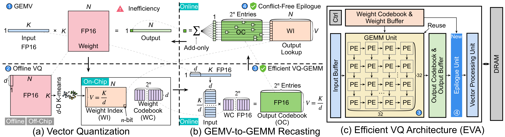

<div align="center">


# EVA: Accelerating LLM Decoding via an Efficient Vector Quantization Architecture

[](https://arxiv.org/abs/2605.24144)
[](https://github.com/dbw6/Eva)
[](https://huggingface.co/collections/dbw6/eva)

</div>

## About the Paper

Large Language Models (LLMs) are inefficient during the autoregressive decoding phase: unlike the compute-bound GEMM operations of prefill, decoding executes a sequence of small, memory-bound GEMV-like computations that underutilize modern accelerators. Weight-only vector quantization (VQ) compresses model weights into a shared codebook and replaces the weight matrix with low-precision indices, reaching 2-bit-level compression, but it still suffers from low GEMV utilization and frequent memory bank conflicts during codebook lookups.

**EVA** is an efficient vector-quantization-based architecture that addresses both bottlenecks. Instead of reconstructing quantized weights from indices, EVA directly computes dot products between input vectors and the weight codebook, recasting LLM decoding from GEMV into GEMM, and then performs structured, conflict-free lookups from an intermediate output codebook. This hardware-software co-design specializes for decoding while staying compatible with conventional prefill execution. EVA achieves up to **11.17× speedup** and **7.17× higher energy efficiency** over the state-of-the-art lookup-based architecture, while preserving arithmetic precision after vector quantization.

<div align="center">


<em>Overview of the EVA computation flow and architecture: (a) vector quantization, (b) GEMV-to-GEMM recasting, and (c) the efficient VQ architecture.</em>
</div>

**Links:** [arXiv paper](https://arxiv.org/abs/2605.24144) · [GitHub repository](https://github.com/dbw6/Eva) · [Hugging Face collection](https://huggingface.co/collections/dbw6/eva)

## Artifact Overview

This repository provides the official implementation and artifacts for the paper "EVA: Accelerating LLM Decoding via an Efficient Vector Quantization Architecture."

This release corresponds to the artifact-evaluated version of the codebase. It includes all scripts, configuration files, and Jupyter notebooks required to reproduce the hardware performance and algorithm accuracy results reported in the paper.

The repository is organized into two main components:

1. **Hardware Simulator** — A config-driven simulator that reproduces all hardware evaluation results (Figures 8--14 and Tables III, VIII, IX, and X). See [`simulator/README.md`](simulator/README.md).
2. **Algorithm Evaluation** — Scripts to reproduce the algorithm-level accuracy tables (Tables V, VI, and VII) using pre-trained AQLM-quantized model checkpoints. See [`algorithm/README.md`](algorithm/README.md).

## Artifact Structure

```
Eva/
├── simulator/                   # Hardware simulator (see simulator/README.md)
│   ├── main.py                  # Unified CLI entrypoint
│   ├── configs/                 # YAML study configurations
│   ├── pipelines/               # Per-study simulation pipelines
│   ├── data/                    # Static reference data
│   ├── traces/                  # Pre-processed trace files
│   └── output/                  # Generated results (CSVs, JSONs)
├── algorithm/                   # Algorithm evaluation (see algorithm/README.md)
│   ├── eval_ppl.py              # WikiText-2 perplexity evaluation
│   ├── lmeval.py                # Downstream accuracy evaluation (lm-eval wrapper)
│   ├── model_loader.py          # AQLM model loader with transformers >=5.x compat fixes
│   ├── output/                  # Algorithm evaluation outputs (JSON, git-ignored)
│   └── src/                     # AQLM source (modelutils, datautils, etc.)
├── scripts/
│   ├── run_simulator_parallel.sh # Parallel hardware simulation runner
│   └── run_algorithm_parallel.sh # Multi-GPU algorithm evaluation runner
├── notebooks/
│   ├── hardware_results.ipynb   # Hardware figure/table reproduction
│   └── algorithm_results.ipynb  # Algorithm table reproduction (optional)
└── pyproject.toml               # Python package definition
```

<!-- ## Study-to-Paper Mapping

| CLI `--study`     | Paper Artifact      | Description                                   |
|-------------------|---------------------|-----------------------------------------------|
| `fig10_fc`        | Fig. 10             | FC decode latency and energy                  |
| `fig9_hw`         | Fig. 9 + TABLE VIII | Area, power, throughput, efficiency breakdown |
| `fig8_dse`        | Fig. 8              | DSE: EU count and bandwidth sweeps            |
| `table_x_abl`     | TABLE X             | Ablation: conflict mitigation, EU scaling     |
| `fig14_index`     | Fig. 14             | Codebook index analysis                       |
| `table_ix_data`   | TABLE IX            | Dataset sequence length statistics            |
| `table_iii_vq`    | TABLE III           | VQ configuration normalized latency           |
| `fig11_batch`     | Fig. 11             | Batch scaling on LLaMA-2-7B                   |
| `e2e`             | Fig. 12 + Fig. 13   | End-to-end dense and MoE experiments          | -->

## Hardware and Software Requirements

### Hardware Simulator (Steps 1--9)

- **CPU**: Any x86-64 machine (no GPU required)
- **RAM**: 16 GB or more
- **Disk**: 10+ GB free space

### Algorithm Evaluation (Optional, Steps 10--12)

- **GPU**: NVIDIA GPU with >=24 GB VRAM (A100-80GB recommended)
- **Disk**: ~100 GB additional for model checkpoints
- **CUDA**: 12.x

### Common

- **OS**: Linux (tested on Ubuntu 20.04+)
- **Python**: 3.11
- **Compiler**: GCC/G++ 11.x recommended (tested with GCC/G++ 11.4.0). AQLM may JIT-compile CUDA/C++ extensions through `ninja`, so the host compiler must be compatible with the installed CUDA toolkit.
- **Network**: Internet access for HuggingFace model/dataset downloads on first run

## Environment Setup

```bash
conda create -n eva python=3.11 -y
conda activate eva
pip install -e .
pip install "aqlm[gpu,cpu]>=1.1.6"
pip install jupyter nbclient
```

For the optional algorithm evaluation, also install:

```bash
pip install torch==2.5.1 torchvision==0.20.1 torchaudio==2.5.1 --index-url https://download.pytorch.org/whl/cu121
pip install "transformers>=5.4.0"
pip install "accelerate>=0.29.3"
pip install "sentencepiece>=0.2.0"
pip install "safetensors>=0.4.0"
pip install lm-eval
```

Notes:
- `aqlm` is required for Table VII, Fig. 14 (hardware), and all algorithm evaluations.
- `datasets` and `transformers` are installed through `pip install -e .`.
- Some studies download gated HuggingFace models on first run. Ensure the environment has access.
- If AQLM CUDA extension builds fail, first check that `gcc --version`, `g++ --version`, and `nvcc --version` report mutually compatible versions. The artifact was evaluated successfully with GCC/G++ 11.4.0 and CUDA 12.1.
- `transformers>=5.4.0` is required for Qwen3MoE model support. The `algorithm/model_loader.py` module automatically patches compatibility issues between `transformers>=5.x` and AQLM checkpoints (see [`algorithm/README.md`](algorithm/README.md) for details).

## Quick Start

```bash
conda activate eva
cd Eva/

# Run all hardware simulation studies (Steps 1--9)
# See simulator/README.md for per-step details
scripts/run_simulator_parallel.sh

# Visualize hardware results
jupyter notebook notebooks/hardware_results.ipynb
```

For the optional algorithm evaluation, see [`algorithm/README.md`](algorithm/README.md). On a multi-GPU system, the full optional evaluation can be launched with:

```bash
GPU_IDS=0,1,2,3 scripts/run_algorithm_parallel.sh
```

## Reference

The code for the algorithm section is based on the following repository:

- **AQLM**: Egiazarian, Vage, et al. "Extreme compression of large language models via additive quantization." arXiv preprint arXiv:2401.06118 (2024). Source code: [https://github.com/Vahe1994/AQLM](https://github.com/Vahe1994/AQLM).
